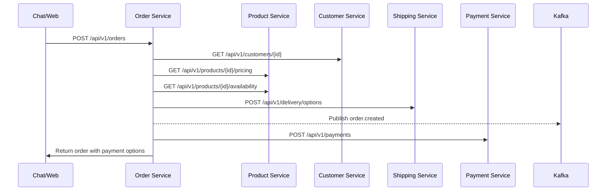

# 🗺️ SAAN Service Integration Map

## 🎯 **Service Communication Overview**

```
┌─────────────────┐    ┌─────────────────┐    ┌─────────────────┐
│   Web App       │    │  Admin Panel    │    │   Chat AI       │
│   (3008)        │    │   (3010)        │    │   (8090)        │
└─────────┬───────┘    └─────────┬───────┘    └─────────┬───────┘
          │                      │                      │
          ▼                      ▼                      ▼
┌─────────────────────────────────────────────────────────────────┐
│                    API Gateway (8080)                          │
└─────────────────────┬───────────────────────────────────────────┘
                      │
          ┌───────────┼───────────┐
          ▼           ▼           ▼
    ┌─────────┐ ┌─────────┐ ┌─────────┐
    │ Order   │ │Customer │ │Product  │
    │ (8081)  │ │ (8110)  │ │ (8083)  │
    └─────┬───┘ └────┬────┘ └────┬────┘
          │          │           │
          ▼          ▼           ▼
    ┌─────────┐ ┌─────────┐ ┌─────────┐
    │Payment  │ │Inventory│ │Shipping │
    │ (8087)  │ │ (8082)  │ │ (8086)  │
    └─────────┘ └─────────┘ └─────────┘
          │          │           │
          ▼          ▼           ▼
    ┌─────────┐ ┌─────────┐ ┌─────────┐
    │Finance  │ │  Chat   │ │  Redis  │
    │ (8088)  │ │ (8090)  │ │ (6379)  │
    └─────────┘ └─────────┘ └─────────┘
```

---

## 📞 **Direct Call Integration Patterns**

### **Order Service Dependencies**
```go
// Order Service calls these services directly:
- Product Service (8083):  Product validation, pricing
- Customer Service (8110): Customer validation, VIP check
- Inventory Service (8082): Stock availability (no reservation)
- Payment Service (8087):  Payment processing
- Shipping Service (8086):  Delivery options, cost calculation
```

### **Product Service Dependencies**
```go
// Product Service calls these services directly:
- Customer Service (8110): VIP level validation
- Loyverse Integration (8100): Product sync
```

### **Payment Service Dependencies**
```go
// Payment Service calls these services directly:
- Order Service (8081): Order validation
- Customer Service (8110): Customer information
- Finance Service (8088): Transaction recording
```

### **Shipping Service Dependencies**
```go
// Shipping Service calls these services directly:
- Customer Service (8110): Address information
- Order Service (8081): Order details for delivery
- External APIs: Grab, LINE MAN, Lalamove (rate comparison)
```

---

## 📨 **Event-Driven Communication**

### **Order Events**
```go
// Order Service publishes:
order.created → [Customer, Inventory, Analytics, Chat]
order.confirmed → [Payment, Shipping, Finance, Customer, Analytics]
order.completed → [Finance, Customer, Analytics, Inventory]
order.cancelled → [Payment, Shipping, Finance, Customer, Inventory]

// Order Service consumes:
payment.confirmed → Update order status
shipping.delivered → Complete order
inventory.stock_updated → Update availability
```

### **Product Events** 
```go
// Product Service publishes:
product.updated → [Order, Chat, Analytics]
product.availability_changed → [Order, Chat, Inventory]
product.price_changed → [Order, Analytics]

// Product Service consumes:
loyverse.product_synced → Update product data
inventory.stock_level_changed → Update availability
```

### **Payment Events**
```go
// Payment Service publishes:
payment.completed → [Order, Finance, Customer]
payment.failed → [Order, Customer]
loyverse.receipt_created → [Finance, Analytics]

// Payment Service consumes:
order.confirmed → Create payment transaction
delivery.completed → Process COD payment
```

---

## 🗄️ **Redis Cache Patterns**

### **Cross-Service Cache Keys**
```redis
# Product caching (used by Order, Chat)
product:{id} → Product details (1 hour TTL)
product:pricing:{id}:{quantity}:{vip} → Pricing calculation (30 min TTL)

# Customer caching (used by Order, Product, Payment)
customer:{id} → Customer details (30 min TTL)
customer:vip:{id} → VIP status (1 hour TTL)

# Order caching (used by Payment, Shipping)
order:active:{customer_id} → Active orders (15 min TTL)
checkout:validation:{customer_id} → Final validation (5 min TTL)

# Shipping caching (used by Order)
shipping:rates:{hash} → Rate comparison results (30 min TTL)
delivery:tracking:{id} → Real-time tracking (2 min TTL)
```

---

## 🔗 **Service Integration Examples**

### **Creating an Order (Complete Flow)**


### **Product Price Calculation**
```go
// Order Service → Product Service
GET http://product:8083/api/v1/products/123/pricing?quantity=10&vip_level=gold&customer_id=456

Response:
{
  "base_price": 100.00,
  "tier_price": 95.00,
  "vip_discount": 5.00,
  "final_price": 90.00,
  "total_price": 900.00,
  "tier_name": "Bulk 10+"
}
```

### **Chat Order Creation**
```go
// Chat Service → Multiple Services
1. Chat AI → Product Service: Search products
2. Chat AI → Customer Service: Get customer VIP status  
3. Chat AI → Order Service: Create draft order
4. Chat AI → Shipping Service: Get delivery options
5. Chat AI → Payment Service: Process payment
```

---

## 🚨 **Critical Integration Points**

### **Data Consistency**
```go
// Products: Loyverse sync preserves admin fields
// Orders: Snapshot on every status change
// Payments: Multi-store receipt creation
// Shipping: Manual provider coordination
```

### **Error Handling**
```go
// Service unavailable → Graceful degradation
// Cache miss → Direct service call with cache refresh
// Event delivery failure → Retry with exponential backoff
// External API failure → Fallback to default values
```

### **Monitoring & Health Checks**
```go
// Health checks: All services /health endpoint
// Circuit breakers: Fail fast on service unavailability  
// Rate limiting: Prevent service overload
// Metrics: Response times, error rates, throughput
```

---

## 📋 **Quick Troubleshooting Guide**

### **Service Down**
```bash
# Check service health
curl http://product:8083/health
curl http://order:8081/health
curl http://customer:8110/health

# Check logs
docker logs product
docker logs order
docker logs customer

# Check dependencies
docker exec redis redis-cli ping
docker exec postgres pg_isready
```

### **Cache Issues**
```bash
# Clear Redis cache
docker exec redis redis-cli FLUSHDB

# Check cache hit rates
docker exec redis redis-cli INFO stats
```

### **Event Issues**
```bash
# Check Kafka topics
docker exec kafka kafka-topics --list --bootstrap-server localhost:9092

# Check consumer lag
docker exec kafka kafka-consumer-groups --bootstrap-server localhost:9092 --describe --all-groups
```

---

## 🎯 **Integration Checklist**

### **Adding New Service**
- [ ] Define API endpoints in `/services/{service}/API.md`
- [ ] Document dependencies in `/services/{service}/INTEGRATION.md`
- [ ] Add health check endpoint
- [ ] Configure service discovery (service names)
- [ ] Set up event publishing/consuming
- [ ] Add Redis cache patterns
- [ ] Update this integration map

### **Modifying Existing Service**
- [ ] Update API documentation
- [ ] Test integration points
- [ ] Update cache invalidation
- [ ] Verify event compatibility
- [ ] Update troubleshooting guide

---

> 🔗 **All services follow SAAN architecture patterns for consistent integration**
