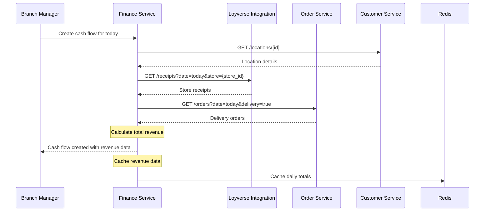
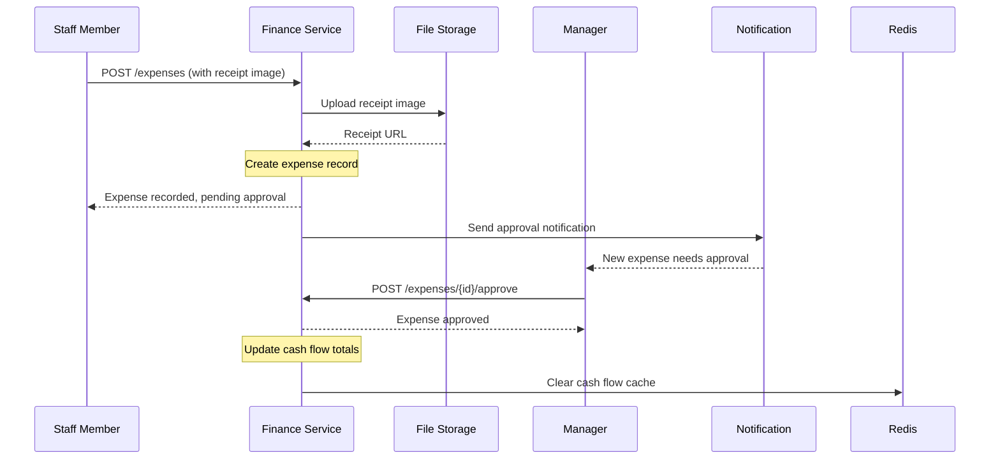
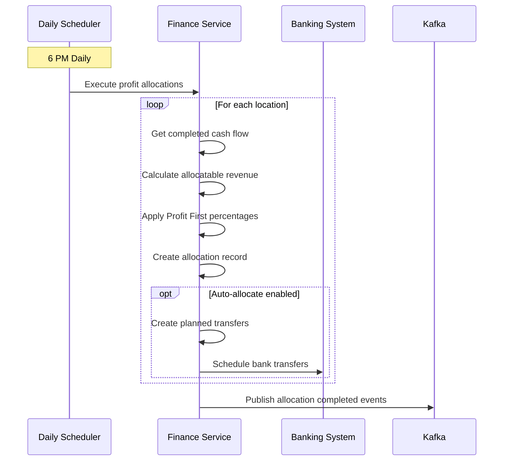

# Finance Service Integration Guide

## 🎯 **Integration Overview**

The Finance Service manages all financial operations for SAAN including daily cash flow tracking, expense management, profit allocation using Profit First methodology, and automated financial reporting. It integrates with Loyverse for receipt processing and provides real-time financial analytics.

---

## 🔄 **Service Dependencies**

### **Required Services**
The Finance Service **depends on** these services for normal operation:

#### **Order Service** (8081)
- **Purpose**: Delivery order revenue tracking, order completion events
- **Critical**: ⚠️ Partial - Required for delivery revenue allocation
- **Fallback**: Manual revenue entry, Loyverse receipt data only

#### **Customer Service** (8110) 
- **Purpose**: Location information, branch/vehicle data
- **Critical**: ✅ Yes - Cannot operate without location data
- **Fallback**: Cached location data for up to 4 hours

#### **Payment Service** (8087)
- **Purpose**: Payment confirmation events, transaction details
- **Critical**: ⚠️ Partial - Required for cash flow accuracy
- **Fallback**: Manual payment tracking

#### **Loyverse Integration** (8091)
- **Purpose**: Receipt data sync, POS transaction records
- **Critical**: ✅ Yes - Primary revenue data source
- **Fallback**: Manual receipt entry (not scalable)

---

## 📞 **Services That Call Finance Service**

### **Order Service** (8081)
```go
// Order completion triggers revenue recording
POST /api/v1/finance/webhooks/order-completed
{
  "order_id": "order_123",
  "total_amount": 450.00,
  "delivery_vehicle_id": "vehicle_456",
  "completed_at": "2024-01-15T14:30:00Z"
}
```

### **Payment Service** (8087)
```go
// Payment confirmation updates cash flow
POST /api/v1/finance/webhooks/payment-confirmed
{
  "payment_id": "pay_123",
  "order_id": "order_456",
  "amount": 450.00,
  "method": "cash",
  "confirmed_at": "2024-01-15T14:35:00Z"
}
```

### **Admin Panel** (3010)
```go
// Financial dashboard and management
GET /api/v1/finance/dashboard
GET /api/v1/finance/cash-flows
POST /api/v1/finance/cash-flows/{id}/approve
GET /api/v1/finance/reports/monthly
```

### **Web App** (3008)
```go
// Manager dashboard financial summary
GET /api/v1/finance/reports/daily?location_id={user_location}
GET /api/v1/finance/cash-position/{location_id}
```

### **Loyverse Integration** (8091)
```go
// Receipt processing webhook
POST /api/v1/finance/webhooks/loyverse-receipt
{
  "receipt_id": "loyverse_123",
  "store_id": "store_456",
  "total_amount": 350.00,
  "receipt_date": "2024-01-15",
  "note": "รถส่ง: รถ 3, คนส่ง: 0812345678"
}
```

---

## 🔄 **Integration Workflows**

### **Daily Cash Flow Creation Flow**


### **Expense Recording Flow**


### **Profit First Allocation Flow**


---

## 🗄️ **Caching Strategy**

### **Redis Cache Patterns**
```redis
# Real-time Financial Metrics (5-15 minutes TTL)
finance:daily_sales:{location_id}:{date} → Running sales total
finance:cash_position:{location_id} → Current cash on hand
finance:pending_expenses:{location_id} → Sum of unapproved expenses
finance:allocation_status:{location_id}:{date} → Profit allocation progress

# Calculation Cache (1-4 hours TTL)
finance:profit_calculation:{location_id}:{date} → Daily profit breakdown
finance:expense_totals:{location_id}:{month} → Monthly expense summaries
finance:revenue_breakdown:{location_id}:{date} → Revenue source analysis
finance:kpi_metrics:{location_id}:{period} → KPI calculations

# Report Cache (1-24 hours TTL)
finance:daily_report:{location_id}:{date} → Complete daily reports
finance:monthly_summary:{location_id}:{month} → Monthly summaries
finance:dashboard_data:{user_id} → User-specific dashboard data
```

### **Cache Invalidation Rules**
```go
// When cash flow is updated
DELETE finance:daily_sales:{location_id}:{date}
DELETE finance:cash_position:{location_id}
DELETE finance:daily_report:{location_id}:{date}

// When expense is approved
DELETE finance:pending_expenses:{location_id}
DELETE finance:expense_totals:{location_id}:*
DELETE finance:daily_report:{location_id}:{date}

// When profit allocation is executed
DELETE finance:allocation_status:{location_id}:{date}
DELETE finance:profit_calculation:{location_id}:{date}
DELETE finance:dashboard_data:*
```

---

## 🚨 **Error Handling Patterns**

### **Service Unavailable Scenarios**

#### **Loyverse Integration Down**
```go
// Critical dependency - Finance cannot function without receipt data
1. Return 503 Service Unavailable for revenue-dependent operations
2. Allow expense recording and manual cash flow entry
3. Cache last known receipt data for up to 2 hours
4. Enable manual receipt entry mode

Response:
{
  "error": "Revenue data unavailable",
  "code": "LOYVERSE_SERVICE_DOWN",
  "fallback_mode": "manual_entry",
  "retry_after": 300
}
```

#### **Order Service Down**
```go
// Partial dependency - Can operate with reduced functionality
1. Skip delivery revenue allocation
2. Use Loyverse receipt data only
3. Flag affected cash flows for manual review
4. Continue normal operations for non-delivery locations

Warning: "Delivery revenue data unavailable - using POS data only"
```

#### **Customer Service Down**
```go
// Use cached location data
1. Check Redis cache for location information
2. If cache miss, use fallback location names
3. Continue operations with reduced location features
4. Queue location updates for when service returns

Fallback: Use cached location data (up to 4 hours old)
```

---

## 📊 **Performance Considerations**

### **Database Optimization**
```sql
-- Critical indexes for Finance Service
CREATE INDEX idx_cash_flows_location_date ON daily_cash_flows(location_id, business_date);
CREATE INDEX idx_cash_flows_status ON daily_cash_flows(status, business_date);
CREATE INDEX idx_expenses_cash_flow ON expense_transactions(cash_flow_id);
CREATE INDEX idx_expenses_category_date ON expense_transactions(expense_category, expense_date);
CREATE INDEX idx_transfers_location_date ON planned_transfers(from_location_id, planned_date);
CREATE INDEX idx_profit_allocations_location ON profit_allocations(location_id, business_date);
CREATE INDEX idx_receipts_date_status ON loyverse_receipt_tracking(receipt_date, processing_status);

-- Partitioning for large tables
CREATE TABLE daily_cash_flows_y2025 PARTITION OF daily_cash_flows
    FOR VALUES FROM ('2025-01-01') TO ('2026-01-01');
```

### **Connection Pooling**
```go
// Database connections
MaxOpenConns: 25
MaxIdleConns: 5
ConnMaxLifetime: 1 * time.Hour

// Redis connections  
PoolSize: 20
MinIdleConns: 5
MaxConnAge: 1 * time.Hour

// Most critical: Loyverse Integration (high frequency)
// Least critical: Customer Service (lookup only)
```

---

## 🔧 **Configuration Management**

### **Service Discovery**
```yaml
# Environment-based service URLs
development:
  order_service: "http://order:8081"
  customer_service: "http://customer:8110"
  loyverse_integration: "http://loyverse:8091"
  
production:
  order_service: "https://order.saan.internal"
  customer_service: "https://customer.saan.internal"
  loyverse_integration: "https://loyverse.saan.internal"
```

### **Circuit Breaker Settings**
```go
// Prevent cascade failures
CircuitBreaker {
  Threshold: 5,        // failures before opening
  Timeout: 30s,        // how long to stay open
  MaxRequests: 3,      // test requests when half-open
}

// Applied to: Loyverse Integration, Order Service
// Not applied to: Customer Service (has cache fallback)
```

---

## 🧪 **Integration Testing**

### **Test Scenarios**
```bash
# 1. Happy path - all services available
./test-cash-flow-creation-success.sh

# 2. Loyverse integration down
./test-loyverse-service-failure.sh

# 3. Order service down
./test-order-service-failure.sh

# 4. High load - multiple concurrent operations
./test-concurrent-expense-processing.sh

# 5. Network partition - Redis unavailable
./test-cache-failure.sh

# 6. Daily profit allocation execution
./test-automated-profit-allocation.sh
```

### **Test Data Setup**
```sql
-- Required test data
INSERT INTO locations (id, name, type) VALUES 
  ('test_branch_123', 'Test Branch', 'branch'),
  ('test_vehicle_456', 'Test Vehicle 1', 'vehicle');

INSERT INTO profit_first_config (location_id, location_type, profit_percentage, owner_pay_percentage, tax_percentage, operating_percentage) VALUES
  ('test_branch_123', 'branch', 5.00, 10.00, 15.00, 70.00);

-- Mock Loyverse receipts
INSERT INTO loyverse_receipt_tracking (loyverse_receipt_id, receipt_date, total_amount, loyverse_store_id) VALUES
  ('test_receipt_001', '2024-01-15', 1500.00, 'test_store_1');
```

---

## 📈 **Monitoring & Alerts**

### **Key Metrics**
```
# Financial processing metrics
cash_flow_creation_rate         # cash flows/day
expense_approval_time          # minutes
profit_allocation_success_rate # percentage
revenue_sync_accuracy          # percentage

# Integration health
loyverse_sync_response_time    # milliseconds
order_service_response_time    # milliseconds
customer_service_response_time # milliseconds

# Business metrics
daily_revenue_variance         # percentage from average
expense_budget_utilization     # percentage
cash_position_alerts          # count
profit_margin_trends          # percentage
```

### **Critical Alerts**
```yaml
# Cash flow not submitted after 8 PM
# Expense approval queue > 10 items
# Profit allocation failure
# Revenue variance > 30% from average
# Any external service timeout > 5s
# Database connection pool exhaustion
```

---

## 🎯 **Integration Checklist**

### **Adding New Financial Integration**
- [ ] Add service URL to configuration
- [ ] Implement circuit breaker pattern
- [ ] Add caching for non-critical calls
- [ ] Define fallback behavior
- [ ] Add health check monitoring
- [ ] Create integration tests
- [ ] Update error handling documentation

### **Modifying Financial Workflow**
- [ ] Update API documentation
- [ ] Test all integration points
- [ ] Verify event compatibility
- [ ] Update cache invalidation logic
- [ ] Check performance impact
- [ ] Update monitoring dashboards
- [ ] Test profit allocation impacts

---

## 🔄 **Event-Driven Integration**

### **Event Publishing Schedule**
```go
// Real-time events (immediate)
expense.approved → [Budgeting, Analytics, Notification]
cash_flow.submitted → [Management, Approval]
financial.alert → [Management, Operations, Notification]

// Daily batch events (scheduled)
profit_allocation.completed → [Accounting, Analytics, Management]
daily_closure.completed → [Reporting, Analytics]
revenue_summary.daily → [Analytics, Reporting]

// Weekly/Monthly events (scheduled)
financial_report.weekly → [Management, Analytics]
budget_analysis.monthly → [Management, Finance]
```

### **Event Consumption Patterns**
```go
// High priority (immediate processing)
order.completed → Update delivery revenue
payment.confirmed → Update cash flow
loyverse.receipt_created → Process receipt allocation

// Medium priority (batched processing)
inventory.purchased → Record supplier expenses
employee.timesheet_approved → Calculate salary expenses

// Low priority (daily processing)
analytics.revenue_calculated → Update KPI cache
reporting.dashboard_updated → Refresh executive metrics
```

---

## 💼 **Business Logic Integration**

### **Profit First Methodology**
```go
// Allocation priority order
1. Profit (5%) → Separate profit account
2. Owner Pay (10%) → Owner salary account  
3. Tax (15%) → Tax reserve account
4. Operating Expenses (70%) → Operating account

// Automated allocation triggers
- Daily at 6 PM for completed cash flows
- Manual trigger for specific dates
- Batch allocation for month-end
```

### **Revenue Recognition Rules**
```go
// Revenue allocation priority
1. Direct POS sales → Allocate to store location
2. Delivery orders with vehicle note → Allocate to specific vehicle
3. Delivery orders without note → Allocate to default delivery vehicle
4. Manual override → Admin-specified allocation
```

### **Expense Approval Workflow**
```go
// Approval thresholds
< 500 THB → Auto-approve for managers
500-2000 THB → Manager approval required
2000-5000 THB → Finance manager approval
> 5000 THB → Executive approval + receipt verification
```

---

> 🔗 **Finance Service integration enables automated financial management with Profit First methodology, real-time cash flow tracking, and comprehensive reporting across all SAAN operations**
