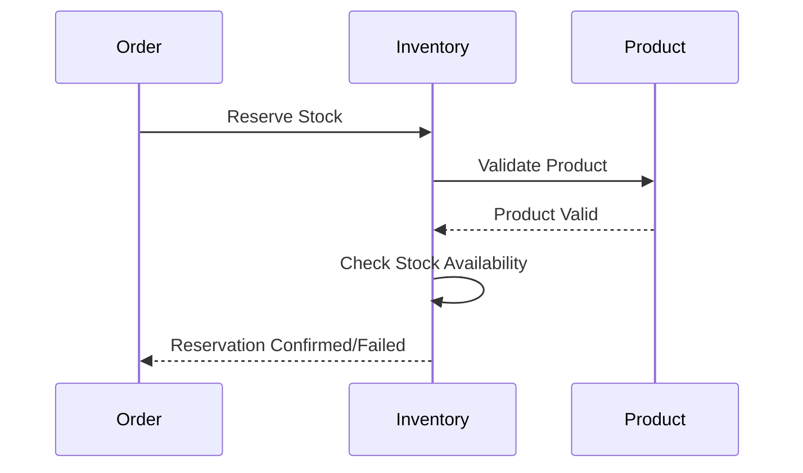
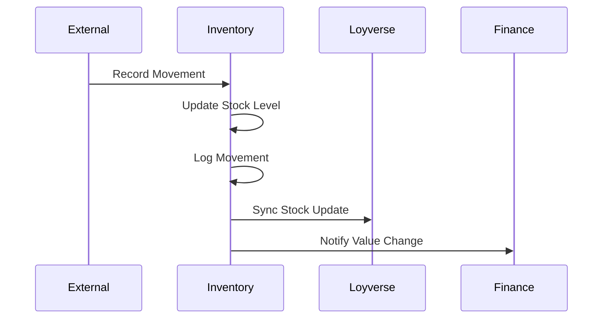
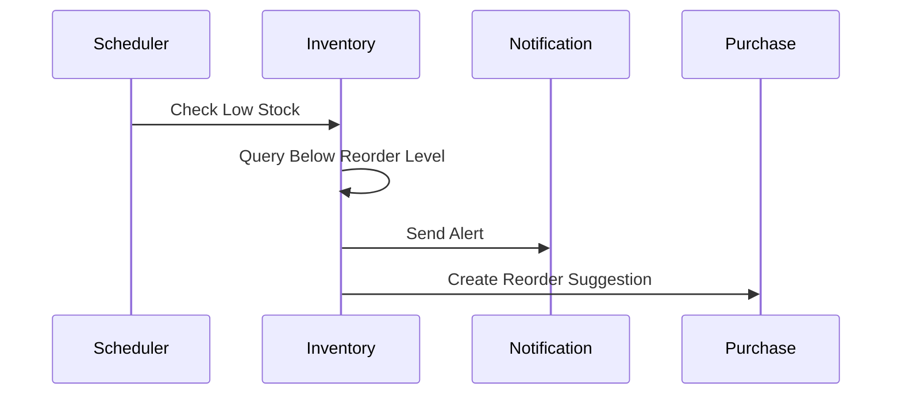

# Inventory Service Integration Guide

## Overview

The Inventory Service manages stock levels, product inventory, and stock movements across all stores in the SAAN system. It integrates with multiple services to maintain accurate inventory tracking.

## Service Integration Map

### Incoming Integrations (Services that call Inventory)

#### Order Service
**Purpose**: Stock reservation and fulfillment
- **Endpoint**: `POST /api/inventory/reserve`
- **When**: Order is created/confirmed
- **Data**: Product IDs, quantities, store ID
- **Response**: Reservation confirmation or stock unavailable

**Endpoint**: `POST /api/inventory/movements`
- **When**: Order is completed/delivered
- **Data**: Stock reduction movements
- **Response**: Movement confirmation

#### Product Service
**Purpose**: Product catalog sync and stock queries
- **Endpoint**: `GET /api/inventory/products/{product_id}/stock`
- **When**: Product details are requested
- **Data**: Product ID, store filter
- **Response**: Current stock levels across stores

#### Finance Service
**Purpose**: Inventory valuation for financial reports
- **Endpoint**: `GET /api/inventory/reports/valuation`
- **When**: Financial reports are generated
- **Data**: Date range, store filter
- **Response**: Inventory value calculations

### Outgoing Integrations (Inventory calls other services)

#### Product Service
**Purpose**: Product information validation
- **Endpoint**: Product Service `/api/products/{id}`
- **When**: Stock movements are recorded
- **Data**: Product ID validation
- **Response**: Product details and validation

#### Loyverse Integration
**Purpose**: Sync inventory data with Loyverse POS
- **Endpoint**: Loyverse Webhook `/api/webhook/inventory-update`
- **When**: Stock levels change
- **Data**: Product ID, store ID, new stock level
- **Response**: Sync confirmation

## Database Schema

### Core Tables

#### products_inventory
```sql
CREATE TABLE products_inventory (
    id UUID PRIMARY KEY DEFAULT gen_random_uuid(),
    product_id UUID NOT NULL,
    name VARCHAR(255) NOT NULL,
    sku VARCHAR(100) NOT NULL,
    barcode VARCHAR(100),
    category_id UUID,
    category_name VARCHAR(255),
    supplier_id UUID,
    supplier_name VARCHAR(255),
    cost_price DECIMAL(10,2) NOT NULL DEFAULT 0,
    sell_price DECIMAL(10,2) NOT NULL DEFAULT 0,
    unit VARCHAR(50) NOT NULL DEFAULT 'pcs',
    description TEXT,
    is_active BOOLEAN NOT NULL DEFAULT true,
    last_updated TIMESTAMP WITH TIME ZONE DEFAULT CURRENT_TIMESTAMP,
    created_at TIMESTAMP WITH TIME ZONE DEFAULT CURRENT_TIMESTAMP,
    
    UNIQUE(product_id),
    INDEX idx_sku (sku),
    INDEX idx_barcode (barcode),
    INDEX idx_category (category_id),
    INDEX idx_supplier (supplier_id)
);
```

#### stock_levels
```sql
CREATE TABLE stock_levels (
    product_id UUID NOT NULL,
    store_id UUID NOT NULL,
    store_name VARCHAR(255) NOT NULL,
    quantity_on_hand DECIMAL(10,3) NOT NULL DEFAULT 0,
    reorder_level DECIMAL(10,3) NOT NULL DEFAULT 0,
    max_stock DECIMAL(10,3) NOT NULL DEFAULT 0,
    is_low_stock BOOLEAN GENERATED ALWAYS AS (quantity_on_hand <= reorder_level) STORED,
    last_updated TIMESTAMP WITH TIME ZONE DEFAULT CURRENT_TIMESTAMP,
    
    PRIMARY KEY (product_id, store_id),
    FOREIGN KEY (product_id) REFERENCES products_inventory(product_id),
    INDEX idx_store (store_id),
    INDEX idx_low_stock (is_low_stock),
    INDEX idx_last_updated (last_updated)
);
```

#### stock_movements
```sql
CREATE TABLE stock_movements (
    id UUID PRIMARY KEY DEFAULT gen_random_uuid(),
    product_id UUID NOT NULL,
    store_id UUID NOT NULL,
    movement_type VARCHAR(50) NOT NULL, -- SALE, PURCHASE, ADJUSTMENT, TRANSFER
    quantity DECIMAL(10,3) NOT NULL,
    quantity_before DECIMAL(10,3) NOT NULL,
    quantity_after DECIMAL(10,3) NOT NULL,
    reference VARCHAR(255), -- Order ID, Adjustment ID, etc.
    notes TEXT,
    created_at TIMESTAMP WITH TIME ZONE DEFAULT CURRENT_TIMESTAMP,
    
    FOREIGN KEY (product_id) REFERENCES products_inventory(product_id),
    INDEX idx_product_store (product_id, store_id),
    INDEX idx_movement_type (movement_type),
    INDEX idx_reference (reference),
    INDEX idx_created_at (created_at)
);
```

## Integration Patterns

### 1. Stock Reservation Pattern


**Implementation:**
```go
// Reserve stock for order
func (s *InventoryService) ReserveStock(ctx context.Context, req ReserveStockRequest) (*ReservationResponse, error) {
    // 1. Validate products exist
    for _, item := range req.Items {
        if err := s.validateProduct(item.ProductID); err != nil {
            return nil, err
        }
    }
    
    // 2. Check stock availability
    for _, item := range req.Items {
        stock, err := s.getStockLevel(item.ProductID, req.StoreID)
        if err != nil {
            return nil, err
        }
        if stock.QuantityOnHand < item.Quantity {
            return nil, ErrInsufficientStock
        }
    }
    
    // 3. Create reservation (temporary hold)
    reservation := &Reservation{
        ID: uuid.New(),
        OrderID: req.OrderID,
        Items: req.Items,
        ExpiresAt: time.Now().Add(15 * time.Minute),
    }
    
    return s.createReservation(reservation)
}
```

### 2. Stock Movement Recording Pattern


**Implementation:**
```go
func (s *InventoryService) RecordMovement(ctx context.Context, movement StockMovement) error {
    tx, err := s.db.BeginTx(ctx, nil)
    if err != nil {
        return err
    }
    defer tx.Rollback()
    
    // 1. Get current stock
    currentStock, err := s.getCurrentStock(movement.ProductID, movement.StoreID)
    if err != nil {
        return err
    }
    
    // 2. Calculate new stock level
    newStock := currentStock + movement.Quantity
    if newStock < 0 && movement.MovementType == "SALE" {
        return ErrInsufficientStock
    }
    
    // 3. Update stock level
    if err := s.updateStockLevel(tx, movement.ProductID, movement.StoreID, newStock); err != nil {
        return err
    }
    
    // 4. Record movement
    movement.QuantityBefore = currentStock
    movement.QuantityAfter = newStock
    if err := s.createMovement(tx, movement); err != nil {
        return err
    }
    
    if err := tx.Commit(); err != nil {
        return err
    }
    
    // 5. Async notifications
    go s.notifyLoyverse(movement)
    go s.notifyFinance(movement)
    
    return nil
}
```

### 3. Low Stock Alert Pattern


## Event Publishing

### Stock Level Changed Event
```json
{
  "event_type": "inventory.stock_level_changed",
  "event_id": "uuid",
  "timestamp": "2024-01-15T10:30:00Z",
  "data": {
    "product_id": "uuid",
    "store_id": "uuid",
    "previous_quantity": 100.0,
    "new_quantity": 95.0,
    "movement_type": "SALE",
    "reference": "ORDER123"
  }
}
```

### Low Stock Alert Event
```json
{
  "event_type": "inventory.low_stock_alert",
  "event_id": "uuid",
  "timestamp": "2024-01-15T10:30:00Z",
  "data": {
    "product_id": "uuid",
    "product_name": "Product Name",
    "sku": "SKU123",
    "store_id": "uuid",
    "store_name": "Store Name",
    "current_quantity": 15.0,
    "reorder_level": 20.0,
    "suggested_order_quantity": 50.0
  }
}
```

## Configuration

### Environment Variables
```env
# Database
DB_HOST=localhost
DB_PORT=5432
DB_USER=inventory_user
DB_PASSWORD=password
DB_NAME=inventory_db

# Redis Cache
REDIS_URL=redis://localhost:6379

# Service Discovery
PRODUCT_SERVICE_URL=http://product-service:8081
FINANCE_SERVICE_URL=http://finance-service:8085

# Loyverse Integration
LOYVERSE_WEBHOOK_URL=http://loyverse-integration:8090/webhook/inventory

# Notifications
NOTIFICATION_SERVICE_URL=http://notification-service:8086

# Stock Reservation
RESERVATION_TIMEOUT_MINUTES=15
LOW_STOCK_CHECK_INTERVAL=1h
```

### Cache Strategy
```go
// Cache stock levels for 5 minutes
func (s *InventoryService) getStockLevelCached(productID, storeID string) (*StockLevel, error) {
    key := fmt.Sprintf("stock:%s:%s", productID, storeID)
    
    // Try cache first
    if cached, err := s.redis.Get(key); err == nil {
        var stock StockLevel
        if err := json.Unmarshal([]byte(cached), &stock); err == nil {
            return &stock, nil
        }
    }
    
    // Fetch from database
    stock, err := s.getStockLevel(productID, storeID)
    if err != nil {
        return nil, err
    }
    
    // Cache for 5 minutes
    data, _ := json.Marshal(stock)
    s.redis.Set(key, data, 5*time.Minute)
    
    return stock, nil
}
```

## Security & Validation

### Input Validation
```go
func (r *ReserveStockRequest) Validate() error {
    if r.OrderID == uuid.Nil {
        return errors.New("order_id is required")
    }
    if r.StoreID == uuid.Nil {
        return errors.New("store_id is required")
    }
    if len(r.Items) == 0 {
        return errors.New("items are required")
    }
    
    for _, item := range r.Items {
        if item.ProductID == uuid.Nil {
            return errors.New("product_id is required for all items")
        }
        if item.Quantity <= 0 {
            return errors.New("quantity must be positive")
        }
    }
    
    return nil
}
```

### Authorization
- Stock viewing: Read access to store inventory
- Stock updates: Write access to store inventory
- Reports: Inventory manager role
- System integrations: Service-to-service authentication

## Performance Considerations

### Database Optimization
- Index on product_id, store_id combinations
- Partition stock_movements table by date
- Aggregate low stock queries with views
- Use read replicas for reports

### Caching Strategy
- Cache frequently accessed stock levels
- Cache low stock alerts
- Invalidate cache on stock updates
- Use Redis for session storage

### Monitoring
- Track stock movement frequency
- Monitor low stock alert generation
- Alert on inventory value changes
- Track integration latency
