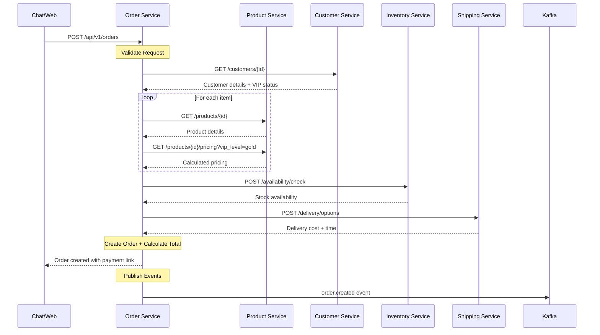
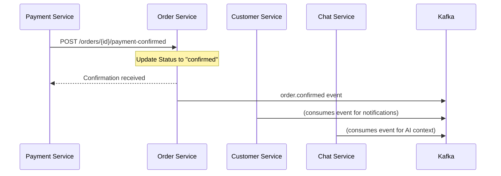

# Order Service Integration Guide

## 🎯 **Integration Overview**

The Order Service acts as the **central orchestrator** for all purchase workflows in the SAAN system. It coordinates with multiple services to validate, process, and fulfill customer orders.

---

## 🔄 **Service Dependencies**

### **Required Services**
The Order Service **depends on** these services for normal operation:

#### **Product Service** (8083)
- **Purpose**: Product validation, pricing calculation, availability check
- **Critical**: ✅ Yes - Cannot create orders without product validation
- **Fallback**: Cache previous product data for 1 hour

#### **Customer Service** (8110) 
- **Purpose**: Customer validation, VIP level determination, address information
- **Critical**: ✅ Yes - Cannot create orders for invalid customers
- **Fallback**: Basic validation only, no VIP pricing

#### **Payment Service** (8087)
- **Purpose**: Payment processing, payment method validation
- **Critical**: ✅ Yes - Cannot confirm orders without payment
- **Fallback**: COD orders only

#### **Shipping Service** (8086)
- **Purpose**: Delivery cost calculation, delivery time estimation
- **Critical**: ⚠️ Partial - Required for delivery orders, not pickup
- **Fallback**: Fixed delivery fee (35 THB), standard estimate (45 min)

#### **Inventory Service** (8082)
- **Purpose**: Real-time stock level checking
- **Critical**: ⚠️ Partial - Can create orders, but may oversell
- **Fallback**: Product service availability flag

---

## 📞 **Services That Call Order Service**

### **Chat Service** (8090)
```go
// Chat AI creates orders on behalf of customers
POST /api/v1/orders
GET /api/v1/orders/{id}
PATCH /api/v1/orders/{id}/status

// Typical chat flow:
1. Customer asks to buy product
2. Chat validates with Product Service
3. Chat creates draft order via Order Service
4. Customer confirms and pays
5. Chat updates order status
```

### **Web App** (3008) & **Admin Panel** (3010)
```go
// Customer-facing order management
POST /api/v1/orders          // Customer places order
GET /api/v1/orders           // Order history
GET /api/v1/orders/{id}      // Order details

// Admin-facing order management  
GET /api/v1/orders?status=all    // All orders dashboard
PATCH /api/v1/orders/{id}/status // Update order status
```

### **Payment Service** (8087)
```go
// Payment confirmation callback
POST /api/v1/orders/{id}/payment-confirmed
{
  "payment_id": "pay_123",
  "amount": 535.00,
  "method": "card",
  "transaction_id": "txn_456"
}
```

### **Shipping Service** (8086)
```go
// Delivery completion callback
POST /api/v1/orders/{id}/delivered
{
  "delivery_id": "del_123", 
  "delivered_at": "2024-01-15T11:20:00Z",
  "driver_id": "driver_456"
}
```

---

## 🔄 **Integration Workflows**

### **Order Creation Flow**


### **Order Confirmation Flow**  


---

## 🗄️ **Caching Strategy**

### **Redis Cache Keys**
```redis
# Customer data (30 min TTL)
order:customer:{customer_id} → Customer details + VIP status

# Product pricing (1 hour TTL)  
order:pricing:{product_id}:{quantity}:{vip_level} → Calculated price

# Delivery options (30 min TTL)
order:delivery:{origin_hash}:{destination_hash} → Shipping options

# Order validation (5 min TTL)
order:validation:{customer_id}:{product_ids_hash} → Validation results

# Active orders (15 min TTL)
order:active:{customer_id} → List of pending/confirmed orders
```

### **Cache Invalidation**
```go
// When customer data changes
DELETE order:customer:{customer_id}

// When product prices change  
DELETE order:pricing:{product_id}:*

// When order status changes
DELETE order:active:{customer_id}
```

---

## 🚨 **Error Handling Patterns**

### **Service Unavailable Scenarios**

#### **Product Service Down**
```go
// Graceful degradation
1. Check Redis cache for product data
2. If cache miss, return 503 Service Unavailable
3. Frontend shows "Try again later" message

Response:
{
  "error": "Product validation unavailable",
  "code": "PRODUCT_SERVICE_DOWN", 
  "retry_after": 30
}
```

#### **Customer Service Down**
```go
// Limited functionality mode
1. Skip VIP pricing (use regular prices)
2. Basic address validation only
3. Log warning for manual review

Warning: "Customer service unavailable - using standard pricing"
```

#### **Payment Service Down**
```go
// COD fallback
1. Only allow Cash on Delivery orders
2. Other payment methods return error
3. Admin notification for manual processing

Response:
{
  "error": "Online payment unavailable", 
  "fallback": "cash_on_delivery_only",
  "message": "You can pay cash when your order arrives"
}
```

---

## 📊 **Performance Considerations**

### **Database Optimization**
```sql
-- Critical indexes for Order Service
CREATE INDEX idx_orders_customer_status ON orders(customer_id, status);
CREATE INDEX idx_orders_created_at ON orders(created_at DESC);
CREATE INDEX idx_order_items_product ON order_items(product_id);

-- Frequently used queries
-- 1. Customer order history
-- 2. Orders by status for admin
-- 3. Product sales analytics
```

### **Connection Pooling**
```go
// Service connections
MaxIdleConns: 10
MaxOpenConns: 100  
ConnMaxLifetime: 1 hour

// Most critical: Product Service (high frequency)
// Least critical: Shipping Service (delivery orders only)
```

---

## 🔧 **Configuration Management**

### **Service Discovery**
```yaml
# Environment-based service URLs
development:
  product_service: "http://product:8083"
  customer_service: "http://customer:8110"
  
production:
  product_service: "https://product.saan.internal"
  customer_service: "https://customer.saan.internal"
```

### **Circuit Breaker Settings**
```go
// Prevent cascade failures
CircuitBreaker {
  Threshold: 5,        // failures before opening
  Timeout: 30s,        // how long to stay open  
  MaxRequests: 3,      // test requests when half-open
}

// Applied to: Product, Customer, Payment services
// Not applied to: Inventory, Shipping (have fallbacks)
```

---

## 🧪 **Integration Testing**

### **Test Scenarios**
```bash
# 1. Happy path - all services available
./test-order-creation-success.sh

# 2. Product service down
./test-product-service-failure.sh

# 3. Payment service down  
./test-payment-service-failure.sh

# 4. High load - multiple concurrent orders
./test-concurrent-order-creation.sh

# 5. Network partition - Redis unavailable
./test-cache-failure.sh
```

### **Test Data Setup**
```sql
-- Required test data
INSERT INTO customers (id, name, vip_level) VALUES 
  ('test_customer_123', 'Test Customer', 'gold');

INSERT INTO products (id, name, price, available) VALUES
  ('test_product_456', 'Test Product', 100.00, true);
```

---

## 📈 **Monitoring & Alerts**

### **Key Metrics**
```
# Order processing metrics
order_creation_rate        # orders/minute
order_creation_success_rate # percentage
order_average_value        # THB
order_completion_time      # minutes

# Integration health
product_service_response_time    # milliseconds
customer_service_response_time   # milliseconds  
payment_service_response_time    # milliseconds

# Error rates
order_validation_failures     # count
payment_processing_failures   # count
external_service_timeouts    # count
```

### **Critical Alerts**
```yaml
# Order creation failure rate > 5%
# Any external service response time > 2s
# Order processing queue > 100 pending
# Database connection pool exhaustion
```

---

## 🎯 **Integration Checklist**

### **Adding New Service Integration**
- [ ] Add service URL to configuration
- [ ] Implement circuit breaker pattern
- [ ] Add caching for non-critical calls
- [ ] Define fallback behavior  
- [ ] Add health check monitoring
- [ ] Create integration tests
- [ ] Update error handling documentation

### **Modifying Order Flow**
- [ ] Update API documentation
- [ ] Test all integration points
- [ ] Verify event compatibility
- [ ] Update cache invalidation logic
- [ ] Check performance impact
- [ ] Update monitoring dashboards

---

> 🔗 **Order Service integration requires careful coordination of multiple services for optimal user experience**
