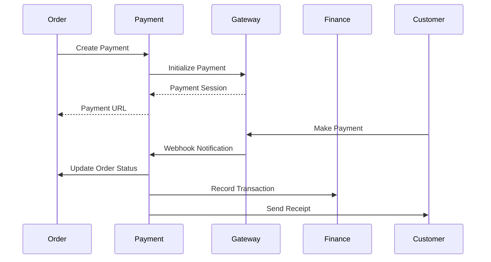
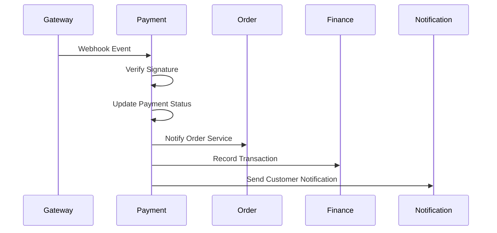
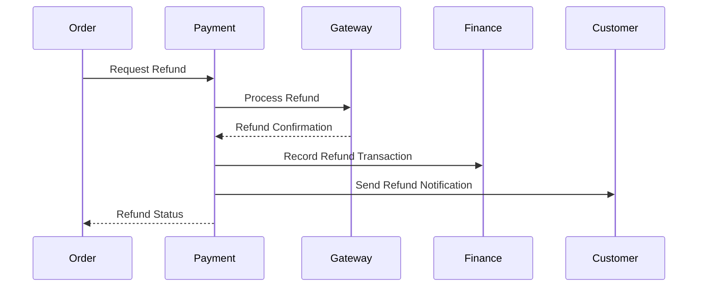

# Payment Service Integration Guide

## Overview

The Payment Service manages all payment processing, gateway integrations, and financial transactions for the SAAN platform. It integrates with multiple payment providers and handles complex payment workflows.

## Service Integration Map

### Incoming Integrations (Services that call Payment)

#### Order Service
**Purpose**: Payment processing for orders
- **Endpoint**: `POST /api/payments`
- **When**: Order is ready for payment
- **Data**: Order ID, customer ID, amount, payment method
- **Response**: Payment session and redirect URL

**Endpoint**: `GET /api/payments/{id}/status`
- **When**: Checking payment completion status
- **Data**: Payment ID
- **Response**: Current payment status

#### Customer Service
**Purpose**: Payment method management
- **Endpoint**: `GET /api/payment-methods`
- **When**: Customer views payment options
- **Data**: Customer preferences, amount
- **Response**: Available payment methods

#### Finance Service
**Purpose**: Financial reconciliation and reporting
- **Endpoint**: `GET /api/payments/reports/summary`
- **When**: Generating financial reports
- **Data**: Date range, filters
- **Response**: Payment summary data

### Outgoing Integrations (Payment calls other services)

#### Order Service
**Purpose**: Update order status after payment
- **Endpoint**: Order Service `/api/orders/{id}/payment-status`
- **When**: Payment status changes
- **Data**: Payment status, transaction details
- **Response**: Order status confirmation

#### Finance Service
**Purpose**: Record financial transactions
- **Endpoint**: Finance Service `/api/finance/transactions`
- **When**: Payment is completed or refunded
- **Data**: Transaction amount, fees, payment method
- **Response**: Financial record confirmation

#### Notification Service
**Purpose**: Send payment notifications
- **Endpoint**: Notification Service `/api/notifications/send`
- **When**: Payment status changes
- **Data**: Customer ID, payment details, template
- **Response**: Notification delivery confirmation

### External Payment Gateway Integrations

#### Omise Integration
```json
{
  "provider": "omise",
  "base_url": "https://api.omise.co",
  "supported_methods": ["credit_card", "internet_banking", "alipay"],
  "currencies": ["THB"],
  "webhook_events": ["charge.complete", "charge.failed", "refund.created"]
}
```

#### C2P Integration
```json
{
  "provider": "c2p",
  "base_url": "https://api.c2p.com",
  "supported_methods": ["qr_code", "bank_transfer"],
  "currencies": ["THB"],
  "webhook_events": ["payment.success", "payment.failed", "payment.cancelled"]
}
```

#### TrueMoney Integration
```json
{
  "provider": "truemoney",
  "base_url": "https://api.truemoney.com",
  "supported_methods": ["wallet", "qr_code"],
  "currencies": ["THB"],
  "webhook_events": ["payment.completed", "payment.failed"]
}
```

## Database Schema

### Core Tables

#### payments
```sql
CREATE TABLE payments (
    id UUID PRIMARY KEY DEFAULT gen_random_uuid(),
    order_id UUID NOT NULL,
    customer_id UUID NOT NULL,
    payment_method VARCHAR(50) NOT NULL, -- cash, credit_card, qr_code, etc.
    payment_provider VARCHAR(50) NOT NULL, -- omise, c2p, truemoney, manual
    amount DECIMAL(10,2) NOT NULL,
    currency VARCHAR(3) NOT NULL DEFAULT 'THB',
    status VARCHAR(50) NOT NULL DEFAULT 'pending',
    
    -- External payment details
    external_transaction_id VARCHAR(255),
    external_payment_id VARCHAR(255),
    payment_gateway_fee DECIMAL(10,2) DEFAULT 0,
    net_amount DECIMAL(10,2) GENERATED ALWAYS AS (amount - payment_gateway_fee) STORED,
    
    -- Payment details
    payment_details JSONB,
    return_url TEXT,
    webhook_url TEXT,
    
    -- Timing
    expires_at TIMESTAMP WITH TIME ZONE,
    paid_at TIMESTAMP WITH TIME ZONE,
    created_at TIMESTAMP WITH TIME ZONE DEFAULT CURRENT_TIMESTAMP,
    updated_at TIMESTAMP WITH TIME ZONE DEFAULT CURRENT_TIMESTAMP,
    
    INDEX idx_order_id (order_id),
    INDEX idx_customer_id (customer_id),
    INDEX idx_status (status),
    INDEX idx_payment_method (payment_method),
    INDEX idx_external_payment_id (external_payment_id),
    INDEX idx_created_at (created_at)
);
```

#### payment_status_history
```sql
CREATE TABLE payment_status_history (
    id UUID PRIMARY KEY DEFAULT gen_random_uuid(),
    payment_id UUID NOT NULL,
    status VARCHAR(50) NOT NULL,
    reason VARCHAR(255),
    details JSONB,
    created_at TIMESTAMP WITH TIME ZONE DEFAULT CURRENT_TIMESTAMP,
    
    FOREIGN KEY (payment_id) REFERENCES payments(id),
    INDEX idx_payment_id (payment_id),
    INDEX idx_status (status),
    INDEX idx_created_at (created_at)
);
```

#### refunds
```sql
CREATE TABLE refunds (
    id UUID PRIMARY KEY DEFAULT gen_random_uuid(),
    payment_id UUID NOT NULL,
    amount DECIMAL(10,2) NOT NULL,
    refund_fee DECIMAL(10,2) DEFAULT 0,
    net_refund DECIMAL(10,2) GENERATED ALWAYS AS (amount - refund_fee) STORED,
    status VARCHAR(50) NOT NULL DEFAULT 'processing',
    reason VARCHAR(100),
    notes TEXT,
    
    external_refund_id VARCHAR(255),
    external_transaction_id VARCHAR(255),
    
    processed_at TIMESTAMP WITH TIME ZONE,
    created_at TIMESTAMP WITH TIME ZONE DEFAULT CURRENT_TIMESTAMP,
    updated_at TIMESTAMP WITH TIME ZONE DEFAULT CURRENT_TIMESTAMP,
    
    FOREIGN KEY (payment_id) REFERENCES payments(id),
    INDEX idx_payment_id (payment_id),
    INDEX idx_status (status),
    INDEX idx_external_refund_id (external_refund_id)
);
```

#### payment_providers
```sql
CREATE TABLE payment_providers (
    id UUID PRIMARY KEY DEFAULT gen_random_uuid(),
    provider_name VARCHAR(50) NOT NULL UNIQUE,
    display_name VARCHAR(100) NOT NULL,
    is_enabled BOOLEAN DEFAULT true,
    configuration JSONB NOT NULL,
    supported_methods TEXT[] NOT NULL,
    supported_currencies TEXT[] NOT NULL,
    
    min_amount DECIMAL(10,2) DEFAULT 0,
    max_amount DECIMAL(10,2),
    processing_fee_percentage DECIMAL(5,4) DEFAULT 0,
    processing_fee_fixed DECIMAL(10,2) DEFAULT 0,
    
    created_at TIMESTAMP WITH TIME ZONE DEFAULT CURRENT_TIMESTAMP,
    updated_at TIMESTAMP WITH TIME ZONE DEFAULT CURRENT_TIMESTAMP,
    
    INDEX idx_provider_name (provider_name),
    INDEX idx_is_enabled (is_enabled)
);
```

## Integration Patterns

### 1. Payment Flow Pattern


**Implementation:**
```go
func (s *PaymentService) CreatePayment(ctx context.Context, req CreatePaymentRequest) (*Payment, error) {
    // 1. Validate request
    if err := req.Validate(); err != nil {
        return nil, err
    }
    
    // 2. Get payment provider
    provider, err := s.getProvider(req.PaymentMethod)
    if err != nil {
        return nil, err
    }
    
    // 3. Create payment record
    payment := &Payment{
        ID:              uuid.New(),
        OrderID:         req.OrderID,
        CustomerID:      req.CustomerID,
        PaymentMethod:   req.PaymentMethod,
        PaymentProvider: provider.Name,
        Amount:          req.Amount,
        Currency:        req.Currency,
        Status:          PaymentPending,
        ExpiresAt:       time.Now().Add(provider.SessionTimeout),
    }
    
    if err := s.repo.Create(payment); err != nil {
        return nil, err
    }
    
    // 4. Initialize with gateway
    gatewayResponse, err := provider.CreatePayment(PaymentRequest{
        Amount:      req.Amount,
        Currency:    req.Currency,
        ReturnURL:   req.ReturnURL,
        WebhookURL:  req.WebhookURL,
        Reference:   payment.ID.String(),
    })
    if err != nil {
        s.updatePaymentStatus(payment.ID, PaymentFailed, err.Error())
        return nil, err
    }
    
    // 5. Update with gateway details
    payment.ExternalPaymentID = &gatewayResponse.PaymentID
    payment.PaymentURL = gatewayResponse.PaymentURL
    
    if err := s.repo.Update(payment); err != nil {
        return nil, err
    }
    
    return payment, nil
}
```

### 2. Webhook Processing Pattern


**Implementation:**
```go
func (s *PaymentService) ProcessWebhook(ctx context.Context, provider string, payload []byte, signature string) error {
    // 1. Get provider instance
    gatewayProvider, err := s.getProvider(provider)
    if err != nil {
        return err
    }
    
    // 2. Verify webhook signature
    if !gatewayProvider.VerifyWebhookSignature(payload, signature) {
        return ErrInvalidWebhookSignature
    }
    
    // 3. Parse webhook event
    event, err := gatewayProvider.ParseWebhookEvent(payload)
    if err != nil {
        return err
    }
    
    // 4. Find payment by external ID
    payment, err := s.repo.GetByExternalPaymentID(event.PaymentID)
    if err != nil {
        return err
    }
    
    // 5. Update payment status
    switch event.Type {
    case "payment.completed":
        err = s.completePayment(payment.ID, event.TransactionID, event.Fee)
    case "payment.failed":
        err = s.failPayment(payment.ID, event.FailureReason)
    case "payment.cancelled":
        err = s.cancelPayment(payment.ID, event.CancellationReason)
    }
    
    if err != nil {
        return err
    }
    
    // 6. Notify other services asynchronously
    go s.notifyOrderService(payment)
    go s.notifyFinanceService(payment)
    go s.sendCustomerNotification(payment)
    
    return nil
}
```

### 3. Refund Processing Pattern


**Implementation:**
```go
func (s *PaymentService) ProcessRefund(ctx context.Context, paymentID uuid.UUID, amount float64, reason string) (*Refund, error) {
    // 1. Get original payment
    payment, err := s.repo.GetByID(paymentID)
    if err != nil {
        return nil, err
    }
    
    if payment.Status != PaymentCompleted {
        return nil, ErrPaymentNotRefundable
    }
    
    // 2. Validate refund amount
    existingRefunds, err := s.refundRepo.GetByPaymentID(paymentID)
    if err != nil {
        return nil, err
    }
    
    totalRefunded := s.calculateTotalRefunded(existingRefunds)
    if totalRefunded+amount > payment.Amount {
        return nil, ErrRefundAmountExceedsPayment
    }
    
    // 3. Create refund record
    refund := &Refund{
        ID:        uuid.New(),
        PaymentID: paymentID,
        Amount:    amount,
        Status:    RefundProcessing,
        Reason:    reason,
    }
    
    if err := s.refundRepo.Create(refund); err != nil {
        return nil, err
    }
    
    // 4. Process with gateway
    provider, err := s.getProvider(payment.PaymentProvider)
    if err != nil {
        return nil, err
    }
    
    gatewayRefund, err := provider.ProcessRefund(RefundRequest{
        PaymentID: *payment.ExternalPaymentID,
        Amount:    amount,
        Reason:    reason,
    })
    if err != nil {
        s.refundRepo.UpdateStatus(refund.ID, RefundFailed, err.Error())
        return nil, err
    }
    
    // 5. Update refund with gateway details
    refund.ExternalRefundID = &gatewayRefund.RefundID
    refund.RefundFee = gatewayRefund.Fee
    refund.Status = RefundCompleted
    refund.ProcessedAt = &gatewayRefund.ProcessedAt
    
    if err := s.refundRepo.Update(refund); err != nil {
        return nil, err
    }
    
    // 6. Notify other services
    go s.notifyFinanceService(refund)
    go s.sendRefundNotification(payment.CustomerID, refund)
    
    return refund, nil
}
```

## Configuration

### Environment Variables
```env
# Database
DB_HOST=localhost
DB_PORT=5432
DB_USER=payment_user
DB_PASSWORD=password
DB_NAME=payment_db

# Redis Cache
REDIS_URL=redis://localhost:6379

# Service Discovery
ORDER_SERVICE_URL=http://order-service:8082
FINANCE_SERVICE_URL=http://finance-service:8085
NOTIFICATION_SERVICE_URL=http://notification-service:8086

# Payment Providers
OMISE_SECRET_KEY=skey_live_...
OMISE_PUBLIC_KEY=pkey_live_...
OMISE_WEBHOOK_SECRET=whsec_...

C2P_MERCHANT_ID=merchant123
C2P_SECRET_KEY=secret_key
C2P_WEBHOOK_SECRET=webhook_secret

TRUEMONEY_APP_ID=app_id
TRUEMONEY_APP_SECRET=app_secret
TRUEMONEY_WEBHOOK_SECRET=webhook_secret

# Security
JWT_SECRET=your_jwt_secret
WEBHOOK_TIMEOUT=30s
PAYMENT_SESSION_TIMEOUT=15m
```

### Provider Configuration
```json
{
  "providers": {
    "omise": {
      "enabled": true,
      "secret_key": "${OMISE_SECRET_KEY}",
      "public_key": "${OMISE_PUBLIC_KEY}",
      "webhook_secret": "${OMISE_WEBHOOK_SECRET}",
      "supported_methods": ["credit_card", "internet_banking"],
      "min_amount": 20.00,
      "max_amount": 200000.00,
      "fee_percentage": 3.0,
      "session_timeout": "15m"
    },
    "c2p": {
      "enabled": true,
      "merchant_id": "${C2P_MERCHANT_ID}",
      "secret_key": "${C2P_SECRET_KEY}",
      "webhook_secret": "${C2P_WEBHOOK_SECRET}",
      "supported_methods": ["qr_code", "bank_transfer"],
      "min_amount": 1.00,
      "max_amount": 100000.00,
      "fee_percentage": 2.5
    }
  }
}
```

## Event Publishing

### Payment Status Change Event
```json
{
  "event_type": "payment.status_changed",
  "event_id": "uuid",
  "timestamp": "2024-01-15T10:35:00Z",
  "data": {
    "payment_id": "uuid",
    "order_id": "uuid",
    "customer_id": "uuid",
    "previous_status": "processing",
    "new_status": "completed",
    "amount": 1500.00,
    "payment_method": "omise",
    "transaction_id": "txn_12345"
  }
}
```

### Refund Processed Event
```json
{
  "event_type": "payment.refund_processed",
  "event_id": "uuid",
  "timestamp": "2024-01-15T11:00:00Z",
  "data": {
    "refund_id": "uuid",
    "payment_id": "uuid",
    "order_id": "uuid",
    "customer_id": "uuid",
    "refund_amount": 1500.00,
    "refund_fee": 15.00,
    "net_refund": 1485.00,
    "reason": "return"
  }
}
```

## Security & Validation

### Webhook Signature Verification
```go
func (p *OmiseProvider) VerifyWebhookSignature(payload []byte, signature string) bool {
    expectedSignature := hmac.New(sha256.New, []byte(p.webhookSecret))
    expectedSignature.Write(payload)
    expected := hex.EncodeToString(expectedSignature.Sum(nil))
    
    return hmac.Equal([]byte(signature), []byte(expected))
}
```

### Payment Data Encryption
```go
func (s *PaymentService) encryptSensitiveData(payment *Payment) error {
    if payment.PaymentDetails != nil {
        encrypted, err := s.encryption.Encrypt(payment.PaymentDetails)
        if err != nil {
            return err
        }
        payment.PaymentDetails = encrypted
    }
    return nil
}
```

### Input Validation
```go
func (r *CreatePaymentRequest) Validate() error {
    if r.OrderID == uuid.Nil {
        return errors.New("order_id is required")
    }
    if r.Amount <= 0 {
        return errors.New("amount must be positive")
    }
    if r.Currency == "" {
        return errors.New("currency is required")
    }
    if !isValidPaymentMethod(r.PaymentMethod) {
        return errors.New("invalid payment method")
    }
    return nil
}
```

## Performance Considerations

### Database Optimization
- Index on frequently queried fields
- Partition large tables by date
- Use read replicas for reporting
- Archive old payment records

### Caching Strategy
- Cache payment provider configurations
- Cache frequently accessed payment methods
- Store payment sessions in Redis
- Cache exchange rates

### Monitoring
- Track payment success rates by provider
- Monitor payment processing times
- Alert on high failure rates
- Track webhook delivery success
